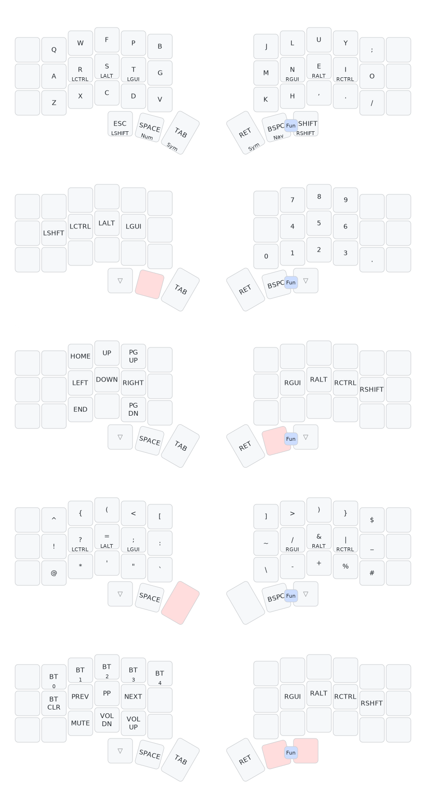

# ZMK Config — Corne Wireless

This repository contains my personal **ZMK firmware configuration** for a **wireless Choc Corne v3** using **Colemak-DH**, **homerow mods**, and optimized layers for programming on macOS.

The canonical keymap lives here: **`config/corne.keymap`**
(Always refer to this file for the most accurate source of truth.)

---

## Keymap Layout



---

## Hardware

- **Keyboard:** Corne v3 Wireless (Typeractive premium aluminium case)
- **Switches:** Sunset tactile or Ambients silent linear (hot-swapped)
- **Keycaps:** MBK Legend Ergo / MCC POM
- **MCUs:** nice!nano v2 (one per half)
- **Battery:** LiPo per half
- **Display:** nice!view
- **Host OS:** macOS (with Vim workflow)

---

## Layout Philosophy

This layout is designed for:

- **Colemak-DH** as the primary typing layout
- **Homerow mods** with balanced flavor and cross-hand triggering
- **Strong thumb usage** for layers and modifiers
- **Programming-oriented symbol layer** with brackets and operators
- **Comfortable navigation** without leaving home position
- **macOS modifier order** (Ctrl, Alt, Gui)

The goal is **minimal movement**, **high reliability**, and **efficient coding**.

---

## Layers Overview

The keymap has 5 layers:

- **Layer 0:** BASE (Colemak-DH + homerow mods)
- **Layer 1:** NUM (Number pad + modifiers)
- **Layer 2:** NAV (Navigation + arrows)
- **Layer 3:** SYM (Symbols + brackets)
- **Layer 4:** FUN (Bluetooth + media controls)

---

## Layer 0: BASE — Colemak-DH + Homerow Mods

Full Colemak-DH alpha layout with homerow modifiers:

### Homerow Mods

- **Left hand:** R = Ctrl, S = Alt, T = Gui
- **Right hand:** N = Gui, E = Alt, I = Ctrl

### Thumb Keys

| Position | Tap | Hold |
|----------|-----|------|
| Left inner | ESC | Left Shift |
| Left middle | Space | NUM layer |
| Left outer | Tab | SYM layer |
| Right outer | Return | SYM layer |
| Right middle | Backspace | NAV layer |
| Right inner | Sticky Shift | Right Shift |

### Combo

- **BSPC + Sticky Shift:** FUN layer

---

## Layer 1: NUM — Number Pad

Number pad layout optimized for right-hand entry:

```
    7  8  9
    4  5  6
0   1  2  3  .
```

- Left homerow has modifiers (Shift, Ctrl, Alt, Gui) for modifier+number combinations
- Decimal point (.) for numeric entry
- **Access:** Hold SPACE

---

## Layer 2: NAV — Navigation

Arrow keys positioned on the left hand for efficient navigation:

### Navigation Keys

- **Homerow:** R = Left, S = Down, T = Right, F = Up
- **Extended:** W = Home, X = End, P = Page Up, D = Page Down

### Right Hand Modifiers

- N = Gui, E = Alt, I = Ctrl, O = Shift

This allows navigation with simultaneous modifiers (e.g., Shift+arrows for selection).

- **Access:** Hold BSPC

---

## Layer 3: SYM — Symbols + Brackets

Programming symbols and special characters:

### Top Row
```
^  {  (  <  [    ]  >  )  }  $
```

### Home Row
```
!  ?  =  ;  :    ~  /  &  |  _
(Ctrl) (Alt) (Gui)    (Gui) (Alt) (Ctrl)
```

### Bottom Row
```
@  *  '  "  `    \  -  +  %  #
```

- Brackets grouped on left side
- Operators and symbols on right side
- Homerow mods available on both hands for modifier+symbol combinations
- **Access:** Hold TAB or RET

---

## Layer 4: FUN — Bluetooth + Media

System controls and connectivity:

### Bluetooth Profiles

- W/F/P/B/Q = BT profiles 1-5
- A = Clear Bluetooth

### Media Controls

- R = Previous track
- S = Play/Pause
- T = Next track
- C = Mute
- D = Volume Down
- V = Volume Up

### Right Hand Modifiers

- N = Gui, E = Alt, I = Ctrl, O = Shift

- **Access:** Combo BSPC + Sticky Shift

---

## Homerow Mod Behavior

Homerow mods use ZMK's `hold-tap` behavior with:

- **Flavor:** `balanced` - waits full tapping-term before deciding
- **Tapping term:** 280ms
- **Quick tap:** 175ms - allows rapid repeated taps
- **Prior idle:** 150ms - prevents accidental mod activation during fast typing
- **Hold trigger on release:** Enabled for more reliable cross-hand activation
- **Hold trigger positions:** Opposite hand + thumb keys

This configuration minimizes false positives while maintaining responsiveness for Colemak-DH's rolling patterns.

---

## Sticky Shift Behavior

The right thumb key uses a custom sticky hold-tap behavior (`sht`):

- **Tap:** Activates sticky shift (one-shot modifier)
- **Hold:** Regular right shift

This provides both one-handed capitalization and traditional shift functionality.

---

## Repository Structure

```
.github/workflows/    # CI build for firmware (UF2 artifacts)
boards/               # Shield/board DT overlays
config/               # Keymap + configuration files
  └── corne.keymap    # Main keymap file
zephyr/               # Device-specific configurations
build.yaml            # Build configuration
```

---

## Building Firmware

### Via GitHub Actions (Recommended)

1. Push changes to `main` branch
2. Navigate to **Actions** tab on GitHub
3. Wait for workflow to complete
4. Download artifacts:
   - `corne_left-nice_nano_v2-zmk.uf2`
   - `corne_right-nice_nano_v2-zmk.uf2`

---

## Flashing nice!nano

For each half:

1. Turn off keyboard
2. Plug one half via USB
3. Double-tap reset button → bootloader drive appears
4. Drag the correct `.uf2` file to the drive
5. Drive will disconnect automatically when flashing completes
6. Repeat for the other half

**Note:** Both halves must be flashed with matching firmware versions.

---

## Customization

To customize the keymap:

1. Edit `config/corne.keymap`
2. Modify as needed:
   - Layer assignments
   - Symbol placements
   - Thumb behaviors
   - Homerow mod timings
3. Commit and push changes
4. GitHub Actions will automatically build new firmware

---

## License

Personal configuration — fork and reuse freely.
